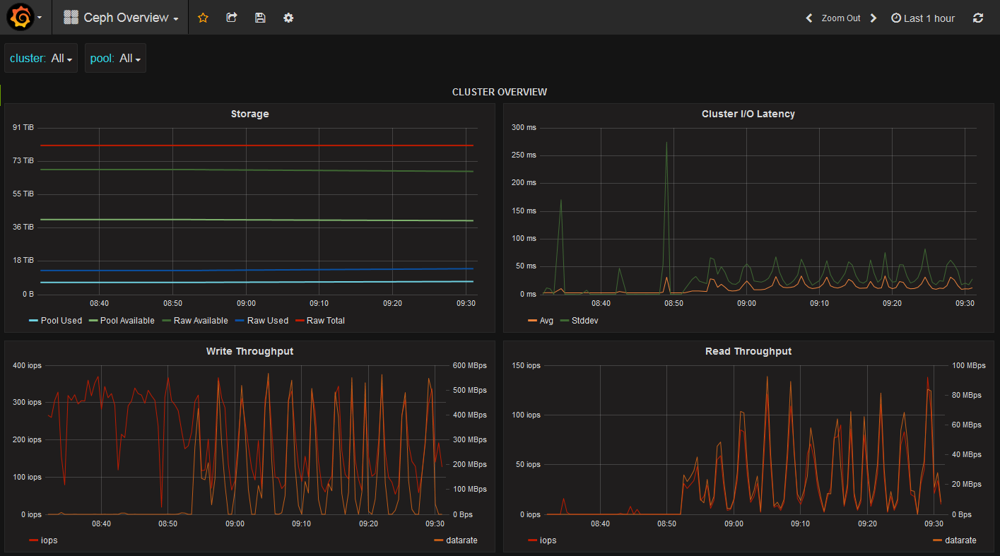
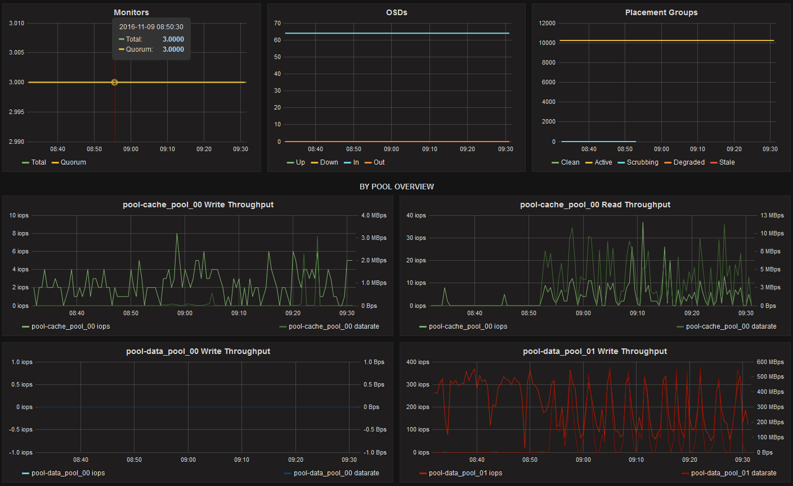
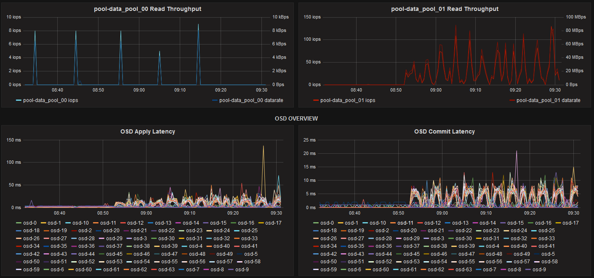
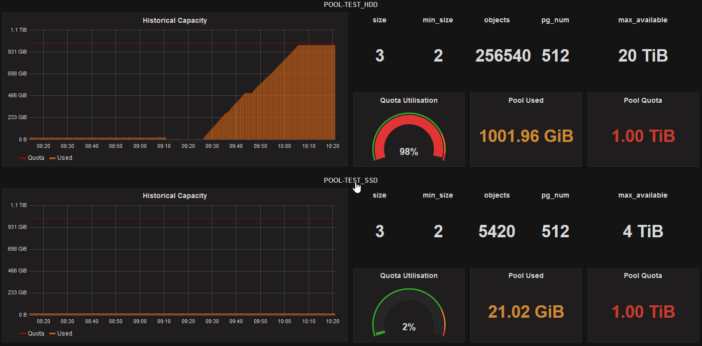

This is a fork of rochaporto's version, which seems to have been abandoned 
around 2015, with plenty of bugs and pull requests lying around. I have tried
to incorporate most of the outstanding pulls and some of the interesting looking 
but not overly conflicting forks.

If __you__ have a clean pull request I will eventually try to merge in. I don't
promise to fix issues but if anyone do I'll merge it.

I don't really want to maintain this but I don't want to let it lying bug-ridden,
I want to use it. 


collectd-ceph
==================

## Overview

A set of collectd plugins monitoring and publishing metrics for Ceph components.

## Screenshots

Sample __Ceph Overview__ dashboard displaying common metrics from the plugins.







Sample __Ceph Pool Capacity__ dashboard, if you are using pool quota this sample may be usefull.



[Check here](grafana/ceph-overview.json) for the __Ceph Overview__ dashboard definition.

[Check here](grafana/ceph-pool-capacity.json) for the __Ceph Pool Capacity__ dashboard definition.

## Plugins and Metrics

There are several plugins, usually mapping to the ceph command line tools.

Find below a list of the available plugins and the metrics they publish.

* ceph_monitor_plugin
  * ceph-&lt;cluster>.mon.gauge.number (total number of monitors)
  * ceph-&lt;cluster>.mon.gauge.quorum (number of monitors in quorum)
* ceph_osd_plugin
  * ceph-&lt;cluster>.osd.gauge.up (number of osds 'up')
  * ceph-&lt;cluster>.osd.gauge.down (number of osds 'down')
  * ceph-&lt;cluster>.osd.gauge.in (number of osds 'in')
  * ceph-&lt;cluster>.osd.gauge.out (number of osds 'out')
* ceph_pool_plugin
  * ceph-&lt;cluster>.pool-&lt;name>.gauge.size (per pool size)
  * ceph-&lt;cluster>.pool-&lt;name>.gauge.min_size (per pool min_size)
  * ceph-&lt;cluster>.pool-&lt;name>.gauge.pg_num (per pool pg_num)
  * ceph-&lt;cluster>.pool-&lt;name>.gauge.pgp_num (per pool pg_placement_num)
  * ceph-&lt;cluster>.pool-&lt;name>.gauge.quota_max_bytes (per pool quota_max_bytes)
  * ceph-&lt;cluster>.pool-&lt;name>.gauge.quota_max_objects (per pool quota_max_objects)
  * ceph-&lt;cluster>.pool-&lt;name>.gauge.max_avail (per pool max_available)
  * ceph-&lt;cluster>.pool-&lt;name>.gauge.objects (per pool objects number)
  * ceph-&lt;cluster>.pool-&lt;name>.gauge.objects (per pool objects number)
  * ceph-&lt;cluster>.pool-&lt;name>.gauge.read_bytes_sec (per pool read bytes/sec)
  * ceph-&lt;cluster>.pool-&lt;name>.gauge.write_bytes_sec (per pool write bytes/sec)
  * ceph-&lt;cluster>.pool-&lt;name>.gauge.op_per_sec (per pool iops)
  * ceph-&lt;cluster>.pool-&lt;name>.gauge.bytes_used (per pool bytes used)
  * ceph-&lt;cluster>.pool-&lt;name>.gauge.kb_used (per pool KBytes used)
  * ceph-&lt;cluster>.pool-&lt;name>.gauge.objects (per pool number of objects)
  min_size
  * ceph-&lt;cluster>.cluster.gauge.total_avail (cluster space available)
  * ceph-&lt;cluster>.cluster.gauge.total_space (cluster total raw space)
  * ceph-&lt;cluster>.cluster.gauge.total_used (cluster raw space used)
* ceph_pg_plugin
  * ceph-&lt;cluster>.pg.gauge.&lt;state> (number of pgs in &lt;state>)
  * ceph-&lt;cluster>.osd-&lt;id>.gauge.fs_commit_latency (fs commit latency for osd)
  * ceph-&lt;cluster>.osd-&lt;id>.gauge.apply_commit_latency (apply commit latency for osd)
  * ceph-&lt;cluster>.osd-&lt;id>.gauge.kb_used (kb used by osd)
  * ceph-&lt;cluster>.osd-&lt;id>.gauge.kb (total space of osd)
* ceph_latency_plugin
  * ceph-&lt;cluster>.cluster.gauge.avg_latency (avg cluster latency)
  * ceph-&lt;cluster>.cluster.gauge.max_latency (max cluster latency)
  * ceph-&lt;cluster>.cluster.gauge.min_latency (min cluster latency)
  * ceph-&lt;cluster>.cluster.gauge.stddev_latency (stddev of cluster latency)

## Requirements

It assumes an existing installation of [collectd](http://collectd.org/documentation.shtml) - check docs for details.

If you want to publish to [graphite](http://graphite.readthedocs.org/), configure 
the [write_graphite](https://collectd.org/wiki/index.php/Plugin:Write_Graphite) collectd plugin.

And you might want the awesome [grafana](http://grafana.org) too, which provides awesome displays.

## Setup and Configuration

The example configuration(s) below assume the plugins to be located under `/usr/lib/collectd/plugins/ceph`.

If you're under ubuntu, consider installing from [this ppa](https://launchpad.net/~rocha-porto/+archive/collectd).

Each plugin should have its own config file, under `/etc/collectd/conf.d/<pluginname>.conf`, which
should follow something similar to:
```
# cat /etc/collectd/conf.d/ceph_pool.conf

<LoadPlugin "python">
    Globals true
</LoadPlugin>

<Plugin "python">
    ModulePath "/usr/lib/collectd/plugins/ceph"

    Import "ceph_pool_plugin"

    <Module "ceph_pool_plugin">
        Verbose "True"
        Cluster "ceph"
        Interval "60"
        TestPool "test"
    </Module>
</Plugin>
```

### Puppet

If you use puppet for configuration, then try this excelent [collectd](https://github.com/pdxcat/puppet-module-collectd) module.

It has plenty of docs on how to use it, but for our specific plugins:
```
  collectd::plugin::python { 'ceph_pool':
    modulepath => '/usr/lib/collectd/plugins/ceph',
    module     => 'ceph_pool_plugin',
    config     => {
      'Verbose'  => 'true',
      'Cluster'  => 'ceph',
      'Interval' => 60,
      'TestPool' => 'test',
    },
  }
```

### Docker

Check [this repo](https://github.com/y4ns0l0/ceph-collectd-graphite) for a nice docker setup to run collectd-ceph (thanks to Ian Babrou).

## Limitations

The debian packaging files are provided, but not yet available in the official repos.

## Development

All contributions more than welcome, just send pull requests.

## License

GPLv2 (check LICENSE).

## Contributors

* Ricardo Rocha <rocha.porto@gmail.com> - original author
* [Peter Gervai (grinapo) - merge maintainer](https://github.com/grinapo)
* [Yann Matysiak (y4ns0l0)](https://github.com/y4ns0l0)
* [Pietari Hyvärinen (kallio)](https://github.com/kallio)
* [gcmalloc](https://github.com/gcmalloc)
* [cfz](https://github.com/cfz)
* [tynorth-cisco](https://github.com/tynorth-cisco)

## Support

Please log tickets and issues at the [github home](https://github.com/grinapo/collectd-ceph/issues).

## Additional Notes

Some [handy instructions](docs/ubuntu.md) on how to build for ubuntu.
